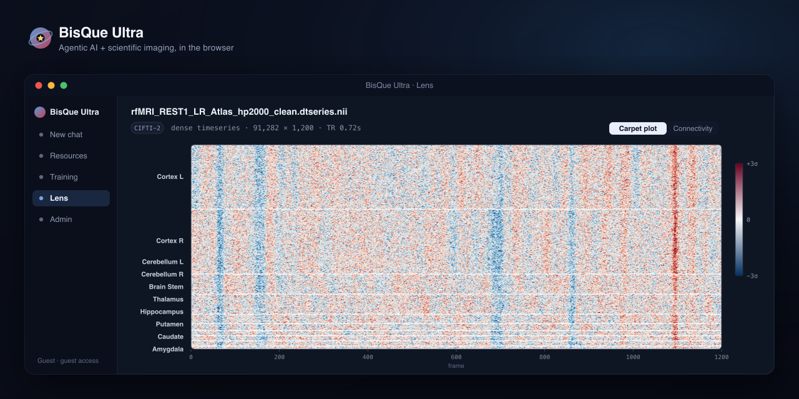

<p align="center">
  
</p>

<h1 align="center">BisQue Ultra</h1>

<p align="center">
  <strong>Scientific imaging, tool-guided analysis, and reproducible model workflows in one local workbench.</strong>
</p>

<p align="center">
  <a href="#quick-start-docker-compose">Quick start (Docker)</a> ·
  <a href="#what-you-are-launching">What you launch</a> ·
  <a href="#step-2-choose-an-openai-compatible-model-endpoint">Choose a model endpoint</a> ·
  <a href="#run-from-source-advanced">Run from source</a> ·
  <a href="#common-failure-modes">Troubleshooting</a>
</p>

BisQue Ultra gives you one surface for scientific images, datasets, metadata, model calls, and long-running tool workflows. An existing BisQue service stores the data, the Go control plane owns runs and access, Deep Agents workers execute long-running tool work, and React keeps the whole process visible. The model layer stays replaceable, so you can point the same platform at any OpenAI-compatible server without rewriting the application around a single vendor.

If you want one sentence to hold the whole system in your head, use this one: BisQue Ultra is a scientific workbench whose data layer is an existing BisQue deployment, whose control plane is Go, whose workers are Deep Agents, whose interface is React, and whose language model can come from any OpenAI-compatible server.

Production deployment and operator runbooks are intentionally kept in private internal documentation rather than the public repo.

## Quick Start (Docker Compose)

The fastest way to run the **entire** stack on a fresh Linux or macOS machine. You need only **Docker** (Docker Desktop on macOS, Docker Engine + Compose plugin on Linux) and a local model server — no Go, Node, Python, or `uv`/`pnpm` required; the images build everything.

**1. Start a model server on your host.** [Ollama](https://ollama.com) is the shortest path:

```bash
ollama serve              # if it isn't already running
ollama pull gpt-oss:20b   # the stack's default model (any OpenAI-compatible model works)
```

**2. Build and launch the whole stack:**

```bash
docker compose up --build      # or: make up   (same thing; auto-loads .env.docker if present)
```

This builds and starts seven services — Postgres, NATS (JetStream), the libbioimage **image service** + its convert worker, the Go **control plane**, the Deep Agents **worker**, and the **frontend**. The first build compiles the native imaging engine (libbioimage/`imgcnv`) from source: budget **~10–30 minutes** the first time (fast on native amd64 Linux; emulated on Apple Silicon). Later runs start in seconds.

**3. Open the app:** **http://localhost:5174**

You are signed in automatically as a local guest (`dev` auth — no account, no cloud). Start chatting (the worker calls your Ollama), or open **Resources** to drag in a scientific image (CZI, ND2, OME-TIFF, NIfTI, DICOM, and 90+ more), a multi-page TIFF z-stack, or a video, and explore it in the Scientific Viewer (tiles, z-scrub, video posters).

**Point at a different model** — no rebuild needed:

```bash
ULTRA_MODEL_NAME=qwen3:32b-fp16 docker compose up                      # another Ollama model
# vLLM on the host instead of Ollama:
ULTRA_MODEL_BASE_URL=http://host.docker.internal:8001/v1 \
ULTRA_MODEL_NAME=openai/gpt-oss-120b docker compose up
```

To set the model, ports, or auth persistently, copy the template and pass it through:

```bash
cp .env.docker.example .env.docker     # then edit it
docker compose --env-file .env.docker up --build
```

Stop with `make down` (or `docker compose down`); durable state — Postgres, uploaded files, and NATS JetStream — persists across restarts. Use `make down-clean` (`docker compose down -v`) to also wipe it. The defaults reach a host model at `http://host.docker.internal:11434/v1` (`host-gateway` is wired for Linux). BisQue import features are off unless you set `ULTRA_BISQUE_ROOT_URL`.

**Scale the agent worker tier.** The worker is a NATS JetStream queue-group consumer, so you can run several against one stack: `make scale-workers N=3`. Before doing so, set an aggregate sandbox cap in `.env.docker` (`ULTRA_SANDBOX_MAX_CONCURRENCY`, e.g. `8`, plus a `ULTRA_SANDBOX_MEMORY=8g` per-container cap) so the replicas can't oversubscribe the single host's Docker daemon.

> Prefer to run the services directly from source (with hot reload, no Docker for the app code)? See [Run from source](#run-from-source-advanced) below.

## What You Are Launching

You are starting seven layers:

1. `backend/controlplane/` serves the BisQue Ultra API (port `8000`).
2. Local **Postgres** and **NATS JetStream** provide durable state and job dispatch.
3. The libbioimage **image service** (`backend/deepagents_runtime/Dockerfile.imaging`) decodes/serves 90+ scientific formats — tiles, slices, histograms, scalar volumes, and ffmpeg video posters — plus a convert worker that builds tiled pyramids on upload.
4. `backend/deepagents_runtime/` runs the durable Deep Agents **worker**.
5. `frontend/` serves the web client (port `5174`).
6. Your **model server** (Ollama or vLLM) answers OpenAI-style chat requests.
7. *(Optional)* An existing **BisQue** deployment provides shared image/dataset/metadata services when `ULTRA_BISQUE_ROOT_URL` is set.

Those layers are deliberately separate. If a page loads but chat fails, the frontend is alive and the API, worker, model server, or durable transport is not. If BisQue imports fail, check the configured BisQue URL and linked credentials before debugging the frontend. That separation is a feature, because it lets you debug the system by following the symptom instead of guessing.

## Run from source (advanced)

If you want hot reload or to iterate on the app code without rebuilding images, run the services directly from source instead of the Docker Compose path above. This needs the language toolchains installed and does **not** include the libbioimage image service unless you build and run it yourself (the Docker Compose path is the supported way to get the imaging engine). Leave `ULTRA_CONTROL_IMAGE_SERVICE_URL` empty to use the legacy native image path.

### Before You Start

Install the tools this path assumes:

- [Go](https://go.dev/dl/) 1.25+ for the control plane
- [uv](https://github.com/astral-sh/uv) for Python dependency management
- [pnpm](https://pnpm.io/) 11.5+ (and Node 22+) for the frontend
- Docker with Compose for local Postgres and NATS

You also need access to a BisQue deployment. For local development, point the app at a reachable BisQue host in `.env`. For staging and production, set `ULTRA_CONTROL_BISQUE_ROOT_URL` in the server-side environment.

You also need one model backend:

- [vLLM](https://docs.vllm.ai/) if you want high-throughput serving for large open-weight models
- [Ollama](https://docs.ollama.com/openai) if you want the shortest path from a workstation to a working local assistant

## The Fastest Mental Model for Configuration

BisQue Ultra keeps the active worker model contract deliberately simple: the Deep Agents runtime reads an OpenAI-compatible endpoint from `OPENAI_BASE_URL`, `OPENAI_MODEL`, and `OPENAI_API_KEY`.

That design matters. It means you can keep the orchestration stable while changing only one layer:

- vLLM for chat and tool reasoning
- Ollama through its OpenAI-compatible `/v1` route
- a remote OpenAI-compatible server today, another tomorrow

The public env template still includes provider-oriented knobs such as `LLM_PROVIDER`, `LLM_*`, `OLLAMA_*`, and `CODEGEN_*` for local tooling and future routing work. For the production-like Go + Deep Agents stack in this repo, set the `OPENAI_*` values explicitly; those are the values passed to the worker.

## Step 1: Create Your Local `.env`

Start from the template:

```bash
cp .env.example .env
```

The public template is now local-first. It no longer points to an internal lab server. Out of the box it assumes:

- BisQue on `http://localhost:8080` or another URL you set explicitly
- API on `http://localhost:8000`
- frontend on `http://localhost:5174`
- vLLM on `http://localhost:8001/v1`
- Ollama on `http://localhost:11434/v1`

You do not need to fill every variable. The important moves are to set the BisQue URL you actually use and decide which inference engine should answer model requests.

## Step 2: Choose an OpenAI-Compatible Model Endpoint

### Option A: vLLM

Choose vLLM when you want a stronger open-weight model, better throughput, or a server that can feed multiple users without turning sluggish. In this repo, vLLM is treated as an OpenAI-compatible endpoint. That is why the environment keys still say `OPENAI_BASE_URL` and `OPENAI_MODEL` even when the actual server is vLLM.

If you want the `.env.example` defaults to work without extra renaming, launch vLLM with a served model name that matches the config:

```bash
vllm serve openai/gpt-oss-120b \
  --host 0.0.0.0 \
  --port 8001 \
  --served-model-name gpt-oss-120b \
  --api-key EMPTY
```

Then keep this shape in `.env`:

```bash
OPENAI_BASE_URL=http://localhost:8001/v1
OPENAI_MODEL=gpt-oss-120b
OPENAI_API_KEY=EMPTY
```

Three details are worth understanding:

- The app talks to the OpenAI-compatible route, so the base URL must end in `/v1`.
- The model name in BisQue Ultra must match the model name vLLM exposes.
- For local OpenAI-compatible servers, a placeholder key like `EMPTY` is often enough. This app already handles that convention.

If you want a different model, change both the vLLM launch command and `OPENAI_MODEL`. Keep them synchronized. When they drift, the API may stay healthy while completions fail with a model-not-found error.

### Option B: Ollama

Choose Ollama when you value simplicity more than throughput. The setup is lighter, the commands are easier to remember, and the cost of experimentation is lower. The tradeoff is that very heavy reasoning or large multimodal workloads may feel better on vLLM-backed hardware.

Start Ollama and pull a model:

```bash
ollama serve
ollama pull qwen2.5:14b-instruct
```

Then set:

```bash
OPENAI_BASE_URL=http://localhost:11434/v1
OPENAI_MODEL=qwen2.5:14b-instruct
OPENAI_API_KEY=EMPTY
```

The `/v1` suffix matters here too. BisQue Ultra uses an OpenAI client under the hood. It does not talk to Ollama’s older native endpoints directly. That single design choice is why the same backend can pivot between Ollama and vLLM without changing the orchestration code.

## Step 3: Install Dependencies

Install the backend:

```bash
uv sync
```

Install the frontend:

```bash
pnpm --dir frontend install
```

If you skip one half, the failure mode will tell on itself. Missing Python dependencies usually break worker or smoke checks. Missing frontend packages usually leave Vite unable to build or serve.

## Step 4: Start the Control Stack

For the production-like V2 stack, use the control stack launcher:

```bash
make restart-control-stack
```

That starts the Go control plane, local Postgres, NATS JetStream, the Deep Agents worker, the RareSpot worker, and the React frontend. It is the path to use when validating durable users, long autonomous runs, refresh/reconnect behavior, and artifact hydration from past chats.

Check the stack with:

```bash
make status-control-stack
```

Stop it with:

```bash
make stop-control-stack
```

The status output should report `store_backend=postgres` and `dispatch_mode=nats_jetstream`. If it reports the in-memory store, user/admin state and past-chat hydration are not production-representative.

## Step 5: Verify the System

Run the control-plane integration gate:

```bash
make verify-integration
```

That check answers the question that matters most for the modern app:

- Can the Go control plane persist and dispatch durable work through Postgres and NATS?

For BisQue connectivity, verify the actual URL configured in `BISQUE_ROOT` or `ULTRA_CONTROL_BISQUE_ROOT_URL`, then link credentials through the app. The public repo no longer carries the embedded BisQue deployment; staging and production should point at the operator-managed BisQue service directly.

You can also check the live endpoints directly:

```bash
curl -fsS http://127.0.0.1:8000/v1/health
curl -I -fsS http://localhost:5174
```

## What the Ports Mean

These ports are easy to confuse because they all belong to one system but not to one process.

- `8080`: common local BisQue service port when you point at a local instance
- `8000`: BisQue Ultra API
- `5174`: BisQue Ultra frontend
- `8001`: example local vLLM endpoint
- `11434`: default Ollama endpoint

If the frontend says the API is unavailable, look at `8000`. If the API is healthy but chat hangs, inspect the worker, NATS, and model endpoint you configured. If BisQue import or browsing fails, check the configured BisQue root URL and the linked credentials.

## Common Failure Modes

### The frontend loads, but chat fails

Usually the API or the model backend is down.

Check:

```bash
make status-control-stack
curl -fsS http://127.0.0.1:8000/v1/health
```

If the API is healthy, your next suspect is the model server. Make sure the base URL ends in `/v1` and the model name in `.env` matches the model name the server actually exposes.

### The control plane starts, then exits

This usually means the environment is incomplete, not that the whole architecture is broken. Run:

```bash
make status-control-stack
make control-test
```

### BisQue imports or browsing fail

Check the BisQue URL and credentials configured for the control plane:

```bash
make status-control-stack
curl -fsS "${BISQUE_ROOT:-http://localhost:8080}/image_service/formats"
```

If the BisQue endpoint is not reachable from the app host, fix that connection before debugging the viewer or chat UI.

### vLLM is up, but the app says the model is missing

The usual mistake is a served-model-name mismatch. If you launch:

```bash
vllm serve openai/gpt-oss-120b
```

then your request model may need to be `openai/gpt-oss-120b` unless you set `--served-model-name gpt-oss-120b`.

### Ollama is running, but requests still fail

Make sure you are pointing at the OpenAI-compatible route:

```bash
OPENAI_BASE_URL=http://localhost:11434/v1
OPENAI_MODEL=qwen2.5:14b-instruct
```

not just:

```bash
http://localhost:11434
```

## Optional Assets

The repo does not vendor large model weights or scientific checkpoints. If you want the full imaging tool surface locally, provision these separately:

- `data/models/medsam2/checkpoints/`
- `data/models/sam3/`
- YOLO or prairie-dog weights such as `RareSpotWeights.pt` and `yolo26x.pt`

The absence of those assets does not stop the web stack from booting. It only narrows which tools can run successfully.

## Repo Layout

- `backend/controlplane/`: Go API, auth/session handling, run control, durable store, and OpenAPI contract
- `backend/deepagents_runtime/`: Python Deep Agents worker runtime, tools, live trace checks, and RareSpot bridge
- `frontend/`: React and Vite client
- `scripts/`: startup and smoke-check helpers

## Workflow-Equivalent Checks

These are the local checks that mirror the active GitHub verification workflows:

```bash
uv sync --frozen --extra dev
pnpm --dir frontend install --frozen-lockfile
make quality
uv run pytest -q
pnpm --dir frontend lint
pnpm --dir frontend typecheck
pnpm --dir frontend test:unit
pnpm --dir frontend build
pnpm --dir frontend bundle:check
pnpm --dir frontend test:smoke
./scripts/release_codescan.sh
```

`./scripts/release_codescan.sh` is the public-release hygiene pass. It scans first-party repo surfaces for secrets, internal-style hostnames, operator-specific storage roots, and other values that should stay in private runbooks instead of the public tree.

For production autonomous-run durability, use the dedicated gate:

```bash
make autonomy-gate
```

This runs the Go control-plane soak test, the live Postgres + NATS integration gate, the Python Deep Agents worker transport tests, deterministic Deep Agents autonomy-quality/routing tests, and the frontend autonomous-chat recovery slice. Together they cover leases, durable worker heartbeats, ack extension, NAK redelivery, cancellation, terminal-event handling, live-trace quality scoring, paper/RareSpot preload routing, refresh-safe stream recovery, stale-conversation recovery, V2 idempotency, and artifact hydration from past chats.

In the production control-plane path, Postgres is the source of truth for users, organizations, threads, messages, runs, run events, artifacts, idempotency keys, worker heartbeats, and Go-owned run leases. NATS JetStream is the durable job/event/cancel transport. The Go control plane also sweeps expired worker leases and requeues the affected non-terminal runs, which keeps long autonomous chats recoverable across worker failure, browser refresh, and control-plane reconnects.

When a full local Go + NATS + Python worker + model stack is already running, run the opt-in live autonomy smoke:

```bash
make autonomy-live-smoke
```

This sends a real two-turn coding task through V2, requires durable code/plot artifacts with verified downloads, and checks that the follow-up uses prior context without corrupting the persisted thread transcript. It is intentionally separate from CI because it depends on a live model and worker stack.

## The Shortest Path to a Working System

If you already know which model you want, this is the whole story:

```bash
cp .env.example .env
uv sync
pnpm --dir frontend install
make restart-control-stack
make verify-integration
```

Then point your browser at [http://localhost:5174](http://localhost:5174).

The rest of this README exists to make that path legible, not longer.
