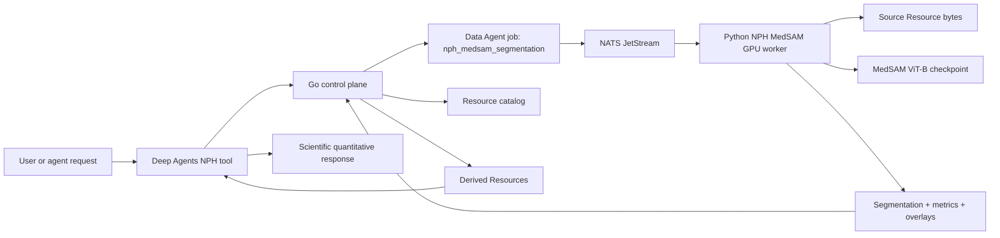

# NPH MedSAM Backend Tool Design

Status: Draft for review before implementation planning.

## Goal

Add a production-ready NPH MedSAM segmentation capability to BisQue Ultra. The system must accept NIfTI, DICOM, and TIFF medical image inputs from Resources, run the fine-tuned MedSAM model on GPU, save the 7-class segmentation and quantitative outputs back to Resources with durable provenance, and expose an agent tool that can answer requests such as:

> Use NPH segmentation on this image and perform quantitative analysis from the resulting segmentation.

The output must be useful to scientists, researchers, and neurosurgeons: quantitative, provenance-rich, explicit about quality-control warnings, and careful not to make unsupported clinical diagnoses.

## Inputs And Model Evidence

Primary checkpoint:

- Local path: `/Users/macbook/Downloads/bisque-20260612.010648/MEDSAM_finetune_CT_NO_SKULLSTRIP_repeated_img_embeddings_no_prompt_7classes_model_best.pt`
- SHA-256: `04b219ad513d60770b648dfc72298cf99a8d7b5cfc70e95217caff17f96a93dc`
- Checkpoint keys: `model`, `optimizer`, `epoch`
- Verified decoder shapes:
  - `mask_decoder.mask_tokens.weight`: `(7, 256)`
  - `iou_prediction_head.layers.2.weight`: `(7, 256)`

External training/inference repo:

- Local path: `/Users/macbook/Downloads/MedSAM_CTsegmentation-main`
- Relevant source: SAM ViT-B with a modified mask decoder, CT preprocessing, whole-image prompt inference, and NPH volume utilities.
- Training shell uses `NUM_CLASSES=6`; the modified SAM builder creates `num_mask_tokens = num_classes + 1`, so production must instantiate with `num_classes=6` while publishing a 7-label output contract.
- Useful production details to preserve:
  - SAM ViT-B architecture changes.
  - Image size 512.
  - Fixed box prompt `[10, 10, 502, 502]`.
  - CT intensity clipping to `[0, 80]` followed by division by `80`.
  - NPH label grouping from `nph_utils`.
- Details to rewrite:
  - Avoid per-slice `.npy` intermediates.
  - Vectorize preprocessing and postprocessing.
  - Resize label maps back to source geometry with nearest-neighbor interpolation.
  - Write segmentation labels as `uint8`.
  - Do not expose the old RBF classifier as a clinical NPH diagnosis.

Initial test Resource:

- `Norm_young_004_40yo.nii.gz` exists under `data/uploads`.
- At least two cataloged copies exist for different owners/orgs; tests must preserve authorization boundaries and use the correct Resource owner context.

## Current Ultra Trace

BisQue Ultra already has the pieces needed for a robust integration, but they are not yet connected for NPH MedSAM:

- Go control plane owns authentication, authorization, Resources, durable Data Agent jobs, events, leases, worker heartbeats, NATS dispatch, and OpenAPI contracts.
- `control_resources` records committed files with owner, organization, project, storage URI/path, checksum, content type, kind, status, tags, and JSON metadata.
- Data Agent jobs exist as durable records with lifecycle APIs, queue dispatch, leases, progress, output summaries, and events.
- Current Data Agent job type validation only allows data-management templates; it must be extended for NPH MedSAM analysis.
- The in-progress image-service work provides a useful pattern: Go protects the API and proxies/dispatches image work, while Python handles image-specific runtime logic.
- Deep Agents has context tools and a RareSpot-style tool pattern for long-running external analysis, but NPH MedSAM should be Resource-native rather than only artifact-native.
- The existing MegaSeg service is a private FastAPI service with bearer auth, local JSON job records, local queue, and artifact download endpoints.
- On `ssh amil@128.111.185.73`, the machine `lambda-quad` has a TITAN RTX 24GB GPU. The systemd MegaSeg container service is inactive, but an older venv-based MegaSeg service is listening on port 8010 from `/home/amil/ultra-megaseg-service`.

## Recommendation

Use a hybrid production architecture:

- Go remains the authority for auth, resource ownership, durable jobs, events, queue dispatch, and catalog writes.
- Python owns GPU MedSAM inference, medical image loading, preprocessing, segmentation, postprocessing, and quantitative measurements.
- Reuse the existing MegaSeg GPU host as compute infrastructure, but do not make the old local-JSON MegaSeg queue the production integration layer.
- Add a new NPH MedSAM worker/service path that consumes Ultra-owned jobs and writes Ultra-owned derived Resources.

This keeps the scientific/model code in the ecosystem that supports PyTorch, nibabel, pydicom, tifffile, scipy, and GPU operations, while keeping production security and lifecycle state in the existing Go control plane.

## Non-Goals

- Do not port MedSAM inference to Go.
- Do not expose the old RBF NPH classifier as a diagnosis.
- Do not claim hydrocephalus, NPH, shunt candidacy, or clinical disease state from segmentation metrics alone.
- Do not require chat agents to copy raw medical volumes into run sandboxes for normal inference.
- Do not replace the existing MegaSeg model; NPH MedSAM is a sibling capability that can share GPU operations.
- Do not support arbitrary SAM prompting in the first production slice. The model contract is whole-image 7-class CT-style segmentation.

## Target Architecture

### Go Control Plane

Go owns all externally visible production contracts:

- Accept and validate NPH MedSAM job creation requests.
- Resolve source Resources under the requesting user, organization, and project.
- Reject unsupported source status, missing storage, deleted Resources, and unauthorized access.
- Create durable Data Agent jobs with `job_type = "nph_medsam_segmentation"`.
- Dispatch work to NATS with owner, org, project, resource id, source storage path, and job id.
- Track status, progress, failure reasons, retries, cancellation, and audit events.
- Catalog derived segmentation and metric files as Resources.
- Attach provenance metadata and source-to-derived relationships.
- Return stable job and Resource ids to the frontend and Deep Agents tool.

### Python NPH MedSAM Runtime

Python owns bounded scientific computation:

- Load NIfTI, DICOM, and TIFF inputs into a canonical 3D scalar volume plus metadata.
- Normalize orientation and geometry carefully enough to preserve output shape, affine, spacing, and source metadata.
- Run the fine-tuned MedSAM model on GPU with the verified checkpoint contract.
- Produce a 7-class `uint8` label volume with the same voxel grid as the source volume whenever the source format supports voxel geometry.
- Compute quantitative measurements and QC checks.
- Write outputs atomically to a worker staging directory.
- Ask the Go control plane to catalog successful outputs.

The runtime should be implemented as a package under `backend/deepagents_runtime/src/ultra_deepagents/nph_medsam/` with small modules:

- `model.py`: SAM model construction, checkpoint verification, lazy GPU load, inference.
- `formats.py`: NIfTI, DICOM, TIFF readers and output metadata adapters.
- `preprocess.py`: CT clipping, resize-to-512, channel packing, batch/slice construction.
- `postprocess.py`: argmax, nearest-neighbor restore, label dtype, connected QC helpers.
- `metrics.py`: voxel counts, volumes, ratios, per-label summaries, peak-slice metrics.
- `resources.py`: output naming and metadata construction.
- `worker.py`: NATS/Data Agent job consumer.
- `tool.py`: agent-facing request/response wrapper if separated from existing context tools.

### GPU Deployment

The first production deployment target is `amil@128.111.185.73`:

- Install a dedicated NPH MedSAM runtime environment rather than modifying the old MegaSeg venv in place.
- Copy the checkpoint to a managed model path on the host and verify SHA-256 before serving work.
- Configure one GPU worker process by default because the TITAN RTX has 24GB memory and MedSAM slices can be memory intensive.
- Use service supervision, logs, health checks, and explicit environment files.
- Keep the existing MegaSeg service available unless the operator intentionally migrates it.

The service should support two deployment shapes:

1. NATS worker mode for production integration with Ultra Data Agent jobs.
2. Local FastAPI smoke mode for direct health and inference diagnostics during deployment.

NATS worker mode is the production path. FastAPI smoke mode is diagnostic only unless a later plan intentionally promotes it.

## Input Contract

The initial supported inputs are Resource-backed files:

- NIfTI: `.nii`, `.nii.gz`
- DICOM: a single DICOM file, a directory-like uploaded series, or a Resource collection that resolves to one series
- TIFF: single-page TIFF, multipage TIFF, or OME-TIFF-style scalar stack when readable by `tifffile`

NIfTI is first-class and should be implemented first, but the implementation is not complete until valid DICOM and valid TIFF inputs also reach the same segmentation and measurement pipeline. DICOM and TIFF support must share the same canonical volume interface but may have format-specific warnings:

- DICOM must reject ambiguous multi-series inputs unless a series is selected.
- DICOM slices should be sorted by `ImagePositionPatient` when available, otherwise `InstanceNumber`, with a warning if sorting metadata is incomplete.
- TIFF spacing should be read from metadata when available; otherwise spacing defaults to 1 mm and emits a QC warning.
- Non-CT intensity inputs are allowed only with an explicit QC warning that the model was trained for CT-style preprocessing.

## Output Contract

Each successful job writes and catalogs at minimum:

- Segmentation NIfTI: `uint8`, same shape as source, source affine/header preserved when possible.
- Summary JSON: model provenance, source provenance, metrics, QC warnings, label schema, runtime details.
- Measurements CSV: one row per label/group plus derived ratios.

Optional first-slice or follow-up outputs:

- Overlay preview PNGs for visual inspection.
- Downsampled viewer pyramid or image-service registration for the Scientific Viewer.
- DICOM SEG export if clinical interoperability becomes a requirement.

Required filename pattern:

- `nph_medsam_seg__<source_stem>__source-<resource_id>__model-04b219ad__<timestamp>.nii.gz`
- `nph_medsam_summary__<source_stem>__source-<resource_id>__model-04b219ad__<timestamp>.json`
- `nph_medsam_measurements__<source_stem>__source-<resource_id>__model-04b219ad__<timestamp>.csv`

All generated Resources must include:

- `source_type = "derived"`
- `resource_kind` appropriate to the output file
- Tags including `nph`, `medsam`, `segmentation`, `derived`, and output-specific tags
- Source Resource id, source checksum, source original name, source storage URI/path
- Model name, checkpoint path label, checkpoint SHA-256, output label count, instantiated `num_classes`
- Preprocessing details: clip range, image size, box prompt, interpolation methods
- Runtime details: worker id, GPU name when available, software versions, generated timestamp
- Job id and parent run/thread context when invoked from Deep Agents

## Label Schema And Measurements

The model output contract is integer labels `0..6`. The initial semantic grouping is based on the training repo utilities:

- Labels `1` and `6`: ventricular CSF / ventricle group
- Labels `2` and `5`: white matter group
- Label `3`: subarachnoid CSF group
- Other labels: reported individually and included in total segmented volume

Because the external repo does not provide a fully authoritative display-name table in the inspected files, the product contract should store both the numeric label schema and the grouped measurement schema. Implementation must make display names data-driven so labels can be corrected without changing stored label values.

Required measurements:

- Per-label voxel count.
- Per-label volume in milliliters.
- Grouped ventricle, white matter, subarachnoid CSF, and total segmented volumes.
- Ventricle-to-total-segmented-volume ratio.
- CSF-to-total-segmented-volume ratio when labels support it.
- Max ventricular axial slice index and ventricular area on that slice.
- 7-slice ventricular volume around the max ventricular slice when enough slices exist.
- Source spacing, voxel volume, shape, and affine summary.

Required QC checks:

- Source shape and output shape match.
- Output values are limited to `0..6`.
- Empty-label warnings for missing expected labels.
- Abnormally high or low ventricular occupancy warning.
- Missing spacing or questionable spacing warning.
- Non-CT or unknown modality warning.
- Geometry-preservation warning when source format cannot preserve affine/header metadata.
- GPU/model provenance verification.

## Agent Tool Contract

Expose a Deep Agents tool named `nph_medsam_analysis`.

Inputs:

- `resource_id` or selected Resource reference.
- Optional `project_id`.
- Optional `analysis_focus`, such as `ventricular_volume`, `csf_volume`, `qc`, or `full_summary`.
- Optional `wait_for_completion` defaulting to true for chat-friendly files and false for long jobs.

Behavior:

- Resolve the Resource through the Go control plane.
- Create or reuse an idempotent NPH MedSAM job for the same source/checkpoint when possible.
- Wait for completion when requested and safe.
- Return derived Resource ids, metric highlights, QC warnings, and provenance.
- Tell the agent not to duplicate the segmentation file into sandbox artifacts.

Agent response quality requirements:

- Lead with the key quantitative findings and units.
- Include source Resource id, segmentation Resource id, model/checkpoint short hash, and generated timestamp.
- Mention QC status and any warnings before interpretive language.
- Use careful wording: "segmentation-derived measurements suggest" rather than diagnostic claims.
- State that the output is for research/analysis support and requires expert review before clinical use.
- For neurosurgical/research users, include enough raw measurements to support independent interpretation.

## Job Lifecycle

1. User or agent selects a source Resource.
2. Go validates authorization, source state, content type, and storage availability.
3. Go creates a durable Data Agent job with `job_type = "nph_medsam_segmentation"`.
4. Go publishes a NATS message containing only nonsecret job and Resource references.
5. Python worker claims the job, verifies the checkpoint, loads source bytes, and emits progress.
6. Worker loads the image into canonical volume metadata.
7. Worker preprocesses CT slices, runs MedSAM inference, restores labels to source geometry, computes metrics, and writes outputs to staging.
8. Worker calls the control plane to catalog derived Resources and attach provenance.
9. Go records output Resource ids in the job summary and emits completion events.
10. Agent tool returns the quantitative result and Resource references.

Cancellation must stop work between source loading, slice batches, and output catalog steps. A canceled job must not catalog partial outputs. Failed jobs may keep local diagnostic logs but should not create successful Resources.

## Error Handling

Use explicit failure categories:

- `unsupported_format`
- `resource_not_found`
- `resource_unauthorized`
- `source_unavailable`
- `ambiguous_dicom_series`
- `invalid_dicom_series`
- `invalid_nifti`
- `invalid_tiff`
- `checkpoint_missing`
- `checkpoint_hash_mismatch`
- `model_load_failed`
- `gpu_unavailable`
- `gpu_oom`
- `inference_failed`
- `geometry_restore_failed`
- `output_validation_failed`
- `catalog_failed`
- `canceled`

The worker should distinguish retryable failures from terminal failures:

- Retryable: temporary source read errors, transient control-plane errors, NATS redelivery, temporary GPU busy conditions.
- Terminal: unsupported format, invalid image, checkpoint hash mismatch, ambiguous DICOM without selected series, output values outside `0..6`.

## Security And Trust

- All user-facing access goes through Go auth and Resource ownership checks.
- Worker messages carry ids and storage references, not raw credentials.
- Worker service credentials must allow only the minimal catalog/job update operations needed.
- Derived Resources inherit owner, organization, project, and relevant source metadata from the source Resource.
- Resource events must link source and derived outputs for auditability.
- Logs must avoid dumping env files, bearer tokens, source PHI-like filenames beyond normal Resource audit context, and raw image metadata that is not needed for diagnosis.
- The model should be clearly labeled as research support, not a regulated clinical diagnostic device.

## Observability

Expose enough metrics to operate the service:

- Queue depth and job age for NPH MedSAM jobs.
- Worker heartbeat, GPU name, CUDA availability, model loaded status, checkpoint hash status.
- Inference duration by input shape/slice count.
- GPU OOM count and retry count.
- Format failure counts.
- Output validation failures.
- Catalog latency and failure count.
- Derived Resource count and bytes written.

Health checks:

- Basic health: process, config loaded, control-plane reachable.
- GPU health: CUDA available, device name, memory summary.
- Model health: checkpoint exists, hash matches, model can be constructed.
- Optional smoke health: synthetic or cached tiny volume inference path.

## Testing And Verification

Testing should be staged so most correctness runs locally without GPU, while the final proof uses the remote GPU host.

Local unit tests:

- NIfTI load/save preserves shape, affine, header-derived spacing, and `uint8` labels.
- DICOM sorting rejects ambiguous multi-series and handles sorted single-series fixtures.
- TIFF stack loading handles multipage scalar fixtures and spacing warnings.
- Preprocessing clips to `[0, 80]`, rescales to `512`, repeats channels, and produces expected tensor shapes.
- Postprocessing uses argmax and nearest-neighbor restore.
- Output validation rejects non-`0..6` labels and shape mismatch.
- Metrics compute voxel volumes from spacing/affine and aggregate label groups correctly.
- Naming and metadata builders include source and checkpoint provenance.
- Go job-type validation accepts `nph_medsam_segmentation` and preserves existing job types.
- Agent tool formats the response with metrics, QC, caveats, and Resource ids.

Local integration tests with fake inference:

- Create a Resource-backed NIfTI fixture.
- Submit an NPH MedSAM job.
- Fake worker writes a deterministic 7-label segmentation.
- Control plane catalogs segmentation, summary JSON, and measurements CSV as derived Resources.
- Job summary contains output Resource ids and metrics.
- The Deep Agents tool can return a scientist-facing answer without GPU.

Remote GPU smoke:

- Deploy the NPH MedSAM worker to `amil@128.111.185.73`.
- Verify CUDA and checkpoint SHA-256.
- Run `Norm_young_004_40yo.nii.gz` through the real checkpoint.
- Confirm output shape matches the source.
- Confirm labels are `0..6`.
- Confirm segmentation Resource metadata inherits source owner/org/project and source checksum.
- Confirm metrics JSON/CSV are cataloged.
- Confirm a chat/tool workflow can answer the requested quantitative-analysis prompt.

Scientist/neurosurgeon response review:

- The answer includes numerical volumes and ratios with units.
- The answer identifies the model/checkpoint and segmentation Resource.
- The answer reports QC warnings plainly.
- The answer avoids diagnosis and recommends expert image review.
- The answer distinguishes measured quantities from interpretation.

## Phased Implementation

### Phase 1: Contracts And Fake Worker

- Add Go domain/API/job-type support for `nph_medsam_segmentation`.
- Add derived Resource cataloging support for model outputs.
- Add Python package skeleton with format, metrics, naming, and fake inference.
- Add Deep Agents tool that can run against fake inference.
- Verify full local lifecycle without GPU.

### Phase 2: Real NIfTI MedSAM Runtime

- Vendor or rewrite the minimal SAM ViT-B model code needed for the checkpoint.
- Add checkpoint verification and lazy GPU model loading.
- Implement NIfTI preprocessing, inference, postprocessing, metrics, and output writing.
- Run local model-load tests where dependencies are available.
- Run remote GPU smoke with `Norm_young_004_40yo.nii.gz`.

### Phase 3: DICOM/TIFF Support

- Add DICOM series resolver and TIFF stack resolver.
- Add fixtures and failure-mode tests.
- Add QC warnings for missing spacing, unknown modality, or ambiguous series.
- Verify output geometry and metrics for representative fixtures.

### Phase 4: Production GPU Deployment

- Add deployment scripts/systemd or container configuration for the NPH MedSAM worker.
- Configure model path, checkpoint hash, NATS/control-plane credentials, concurrency, and output storage.
- Add operational health checks and log paths.
- Keep MegaSeg service intact while sharing the host.

### Phase 5: End-To-End Scientific Workflow

- Run the complete agent prompt against the real test Resource.
- Confirm derived Resources are visible and usable.
- Confirm the final answer meets the scientist/researcher/neurosurgeon quality rubric.
- Record verification evidence in the implementation plan or acceptance matrix.

## Acceptance Criteria

- A Resource-backed NIfTI file can be segmented by the real checkpoint on GPU.
- Valid single-series DICOM and valid scalar TIFF inputs can be segmented by the same pipeline, while invalid or ambiguous DICOM/TIFF inputs fail with precise format/QC errors.
- The segmentation output is a same-grid 7-class `uint8` label map.
- Summary JSON and measurements CSV are saved as derived Resources.
- All derived Resources inherit owner, organization, project, and source provenance.
- The Go control plane owns authorization, durable job lifecycle, and catalog records.
- The Python runtime owns model inference and medical image computation.
- The old MegaSeg local-JSON queue is not the production source of truth.
- The Deep Agents tool can complete the requested NPH quantitative analysis workflow.
- Scientist-facing responses include metrics, units, provenance, QC, and non-diagnostic caveats.
- Unit, integration, deployment, and remote GPU smoke tests provide current evidence for the above.
