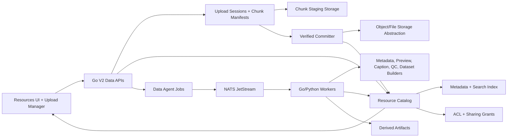

# BisQue Ultra Data Management And Resources Design

Status: Draft for review before product implementation.

## Goal

Elevate BisQue Ultra's Resources page and backend data-management layer into a reliable scientific data console for heavy research users who upload and manage large datasets, including hundreds of gigabytes, thousands of files, and unstable field-network conditions such as Starlink.

The system must make data operations resumable, auditable, searchable, collaborative, and agent-assisted without weakening existing BisQue imports, artifact promotion, Scientific Viewer behavior, chat context, auth boundaries, production links, or the Go control-plane direction.

## Current Trace

The current system has a useful foundation but is not yet shaped for 500GB-class scientific data management.

- `frontend/src/lib/api.ts` exposes `uploadFiles(files)` as a single multipart `/v2/uploads` request. A resumable helper exists, but it is private, sequential, file-at-a-time, and bound to older `/v1/uploads/resumable/*` endpoints rather than the V2 Resources flow.
- `backend/controlplane/internal/httpapi/handlers.go` handles `/v2/uploads` by parsing one multipart form, saving each file, enforcing quota, and cataloging the result. This is simple and correct for small uploads, but it cannot survive browser refresh, backend restart, machine sleep, or mid-file network loss.
- `backend/controlplane/internal/store/schema.sql` has `control_resources` and `control_resource_events`, which is the right nucleus for a durable catalog. It does not yet have upload sessions, chunk manifests, collection membership, dataset snapshots, caption/index records, ACL grants, or Data Agent job records.
- `backend/controlplane/internal/store/queries.sql` filters Resources by owner, status, kind, source, project, and a broad `LIKE` query. This is acceptable for early catalogs but not enough for large faceted metadata search.
- `frontend/src/components/ResourceBrowser.tsx` is a card-grid browser with upload, search, type/source filters, refresh, lazy load, delete, view, and use-in-chat. It is calm, but it lacks virtualized dense browsing, bulk selection, folders, dataset building, job/status columns, facets, and upload session visibility.
- `frontend/src/App.tsx` keeps Resources upload state as one boolean and refreshes the list after a batch upload. It already has valuable chat staging through `stageResourcesForConversation`, which should be preserved and expanded to resource sets.
- BisQue import and artifact promotion already catalog resources through the same resource path. These should become first-class sources in the new catalog rather than side flows.
- Go run-control, Postgres/sqlc, NATS JetStream, durable event replay, leases, worker heartbeats, and Deep Agents runtime envelopes already exist. The Data Agent should reuse that control-plane reliability instead of becoming a fragile frontend chat shortcut.
- Deep Agents context tools can currently stage selected uploads by copying files into a run workspace. Data-management jobs must avoid default whole-file copying for giant datasets; they should operate catalog-first and stream or stage bytes only when an extractor requires it.

Primary platform references:

- OpenAI Codex Goals guidance: <https://developers.openai.com/cookbook/examples/codex/using_goals_in_codex>
- Deep Agents overview: <https://docs.langchain.com/oss/python/deepagents/overview>
- Deep Agents context engineering: <https://docs.langchain.com/oss/python/deepagents/context-engineering>
- Deep Agents memory: <https://docs.langchain.com/oss/python/deepagents/memory>

## Design Principles

1. Resumability is the default. Uploads are sessions with durable manifests, not one-shot HTTP requests.
2. Catalog first, bytes second. Every committed resource has ownership, checksum, lifecycle state, provenance, and audit history. Background jobs should usually query metadata before touching bytes.
3. Idempotent and inspectable. Retried browser requests, server restarts, worker redelivery, and page refreshes must converge on the same upload/job/resource state.
4. Small UI, large capability. The Resources page should feel like a calm scientific data console: dense when needed, visual when helpful, and never noisy.
5. Agent jobs are products, not prompts. The Data Agent runs predefined, auditable, resumable jobs with visible inputs, outputs, status, permissions, and events.
6. Preserve existing strengths. Keep the Go control plane, OpenAPI, pgx/sqlc/Postgres, NATS JetStream, Deep Agents, V2 contracts, BisQue import, artifact promotion, Scientific Viewer, and chat staging paths.
7. Design for proxy verification. Local tests may use synthetic sparse/random fixtures instead of real 500GB uploads, but the evidence must honestly label what is simulated.

## Target Architecture

### Upload Plane

Add V2 upload sessions as the new core upload path. Keep `/v2/uploads` as a compatibility wrapper for small uploads, but internally route large uploads and folder uploads through durable sessions.

Core behavior:

- `POST /v2/upload-sessions` creates a durable session for one file, many files, or a folder manifest.
- The client records upload queue state in IndexedDB so refreshes and browser restarts can resume.
- The server records session state in Postgres so backend restarts and worker restarts can resume.
- Chunks are idempotent by `(session_id, file_id, chunk_index, offset, size, checksum)`.
- Each chunk stores `bytes_received`, `checksum`, `verified_at`, `storage_uri`, retry count, and error state.
- Completion verifies all required chunks, computes full-file checksum, detects duplicates, commits bytes atomically, catalogs the resource, and records `resource.upload_committed`.
- Pause, resume, retry, cancel, and cleanup are explicit lifecycle transitions.
- Adaptive parallelism is a client policy bounded by server backpressure hints.
- Thousands of small files use a folder/batch manifest and controlled concurrency rather than one giant multipart form.
- The UI shows bytes selected, bytes received, bytes verified, bytes committed, throughput, estimated time, retry count, stalled chunks, and server state after reconnect.

Recommended endpoints:

- `POST /v2/upload-sessions`
- `GET /v2/upload-sessions/{session_id}`
- `POST /v2/upload-sessions/{session_id}/files`
- `PUT /v2/upload-sessions/{session_id}/files/{file_token}/chunks/{chunk_index}`
- `POST /v2/upload-sessions/{session_id}/files/{file_token}/complete`
- `POST /v2/upload-sessions/{session_id}/complete`
- `POST /v2/upload-sessions/{session_id}/pause`
- `POST /v2/upload-sessions/{session_id}/resume`
- `POST /v2/upload-sessions/{session_id}/cancel`

### Catalog And Storage Model

Keep `control_resources` as the committed-resource authority, then add adjacent tables rather than overloading its JSON metadata.

Recommended tables:

- `control_upload_sessions`: owner, org, project, source, status, total bytes, received bytes, verified bytes, committed bytes, idempotency key, browser fingerprint, failure reason, timestamps.
- `control_upload_session_files`: session file token, original path, relative folder path, content type, size, declared checksum, computed checksum, status, resource id after commit.
- `control_upload_chunks`: file token, chunk index, offset, length, checksum, status, storage URI, received/verified timestamps.
- `control_resource_metadata`: normalized extracted fields, domain descriptors, dimensions, scanner/acquisition fields, NIfTI header summary, PDF properties, table schema summary, and caption status.
- `control_resource_search_documents`: full-text/search document rows built from filename, caption, extracted metadata, tags, labels, scientific descriptors, and provenance.
- `control_resource_collections`: folders, collections, projects, and dataset containers with parent relationships.
- `control_resource_collection_members`: resource-to-container membership with ordering, role, and audit metadata.
- `control_dataset_snapshots`: immutable dataset versions with resource ids, checksums, filters used, creator, and timestamp.
- `control_resource_acl_grants`: user/group/role grants for resources, folders, collections, and datasets.
- `control_data_agent_jobs`: background job authority with job type, input selector, status, progress, retry state, output summary, and actor.
- `control_data_agent_events`: append-only job audit events.

Storage should remain file-system-compatible locally while hiding implementation behind storage interfaces. The abstraction must support local disk now and object-storage-style keys later.

### Resources Page

Replace the card-only browser with a Resources Console that scales from a small lab session to large catalogs.

Recommended layout:

- Left rail: projects, folders, collections, datasets, shared with me, recent imports, upload sessions.
- Top bar: search, upload, create folder/collection/dataset, filters, view mode, refresh.
- Main area: virtualized dense table by default for large catalogs, preview grid when visual inspection matters.
- Right panel: details, provenance, metadata, permissions, agent jobs, audit history, and Scientific Viewer launch.
- Bottom or drawer upload manager: active uploads, paused sessions, failed chunks, retry controls, throughput, and post-refresh recovery state.

Table columns should be configurable, with defaults for name, type, size, status, owner, project, source, created date, checksum, processing, caption, sharing, and dataset membership.

Bulk actions:

- Move to folder or collection.
- Add or remove tags.
- Create dataset from selection or query.
- Share with user, group, or organization role.
- Run Data Agent job on selection.
- Delete, restore, or export manifest.
- Add selected resources to chat context.

Filtering/search:

- Type, source, project, folder, dataset, owner, status, processing status, caption status, sharing status, date range, size range, tags, metadata fields, checksum, and scientific descriptors.
- Query search across filenames, captions, extracted metadata, tags, source URIs, and generated summaries.
- Cursor pagination should replace offset pagination for large, mutating result sets.

### Data Agent

Introduce a dedicated Data Agent job system for predefined background work. It should use the existing Go control plane, NATS JetStream, durable events, leases, worker heartbeats, and Deep Agents runtime for higher-level reasoning.

The Data Agent should not be a one-shot chat prompt. It should expose job templates with clear inputs, permissions, progress, outputs, retry policy, and audit events.

Initial job types:

- Organize resources into folders or collections based on filename, metadata, source, timestamps, or acquisition patterns.
- Generate short captions and metadata summaries.
- Extract metadata from images, NIfTI files, PDFs, tables, microscopy formats, and BisQue-imported records.
- Detect exact duplicate files by checksum and near duplicates by derived fingerprints.
- Identify incomplete, corrupt, unsupported, or suspicious resources.
- Suggest dataset groupings for training and analysis.
- Batch-tag resources.
- Create dataset snapshots from selected folders or query results.
- Share resources, folders, or datasets after explicit user approval.
- Prepare data manifests for downstream model training or Scientific Viewer workflows.

Deep Agents fit:

- Use runtime context for user, org, project, selected resource ids, query selectors, and job policy.
- Use filesystem/memory for large intermediate summaries and job manifests, not for raw 500GB payloads.
- Use subagents for heavy metadata/captioning/review batches when the work naturally decomposes.
- Use context compression and concise job summaries so long-running jobs remain inspectable without stuffing every resource into model context.
- Require human approval for sharing, deletion, restoration, broad permission changes, and destructive organization actions.

### Security, Trust, And Collaboration

Every data-management action should be authorization-checked and audit-logged.

Required trust model:

- Ownership by user, project, and organization.
- ACL grants for user, group, and role access.
- Read, write, manage, share, delete, restore, and agent-run permissions.
- Dataset snapshots are immutable for reproducibility.
- Soft delete and restore are first-class.
- Provenance connects original upload/import, chunk session, checksum, resource record, metadata extraction, derived artifacts, dataset snapshots, and agent actions.
- Raw linked-account credentials and BisQue session refs must never be exposed to frontend job metadata or model-visible context.
- Private, shared, and public resources must be visually and technically distinct.

### Observability And Operations

Add metrics and traces that make data reliability visible:

- Upload sessions by status, age, size, project, and user.
- Bytes received, verified, committed, retried, discarded, and deduplicated.
- Chunk retries, checksum failures, stalled sessions, and cancel/cleanup counts.
- Resource catalog query latency, facet latency, result counts, and index freshness.
- Worker queue depth, job age, job retries, failure reasons, and throughput by job type.
- Storage accounting by owner, project, organization, source, and lifecycle state.
- Backpressure signals when per-user, per-org, or global concurrency limits are reached.

## Phased Implementation Plan

### Phase 0: Baseline And Contracts

Produce current-state traces and tests before changing product behavior.

- Baseline `/v2/uploads`, existing `/v1/uploads/resumable/*`, `/v2/resources`, BisQue import, artifact promotion, Scientific Viewer open, and chat staging.
- Add contract tests for the current behaviors that must remain compatible.
- Add synthetic resource-catalog fixtures for 10k and 100k records.
- Add upload interruption test scaffolding with simulated chunk failure, browser refresh, and backend restart boundaries.
- Confirm OpenAPI and sqlc generation workflow.

### Phase 1: Durable V2 Upload Sessions

Build the backend session model, chunk manifest, and commit lifecycle.

- Add Postgres schema and sqlc queries for sessions, files, chunks, and events.
- Add in-memory store parity for fast tests.
- Add V2 upload-session endpoints to OpenAPI and Go handlers.
- Add chunk checksum validation and full-file checksum verification.
- Add idempotency for session creation, chunk retry, and completion.
- Keep `/v2/uploads` working through the new commit path for small files.
- Verify resume after interrupted chunks and backend restart with integration tests.

### Phase 2: Frontend Upload Manager

Replace single boolean upload state with a durable upload queue.

- Add IndexedDB upload queue records keyed by user, org, project, file fingerprint, and session id.
- Add adaptive parallel chunk uploads with server backpressure hints.
- Add pause, resume, retry, cancel, and reconnect behavior.
- Add Resources upload manager UI with progress that survives page refresh.
- Add folder upload support with relative path preservation.
- Verify browser refresh/reconnect, flaky network simulation, thousands of small files, and large synthetic files.

### Phase 3: Catalog, Organization, And Search

Expand the resource catalog into a scientific data index.

- Add metadata, search document, collection, membership, dataset snapshot, ACL, and audit tables.
- Replace offset listing with cursor pagination where large catalogs need stability.
- Add full-text and JSONB/GIN indexes for filenames, captions, metadata, tags, source URIs, and descriptors.
- Add folder, collection, dataset, tag, owner, project, source, status, processing, sharing, date, and size filters.
- Add bulk actions and collection/dataset APIs.
- Verify query latency and UI behavior with large fixtures.

### Phase 4: Resources Console UI

Elevate the Resources page into the high-performance data console.

- Add virtualized table mode with stable row dimensions.
- Add preview grid mode for visual inspection.
- Add left navigation for folders, collections, datasets, shared resources, and uploads.
- Add right details panel for metadata, provenance, permissions, audit history, and agent jobs.
- Add bulk selection and action toolbar.
- Preserve View, Use in chat, BisQue links, artifact resources, and Scientific Viewer compatibility.
- Verify responsive layout, keyboard selection, screen-reader labels, large catalogs, and smoke tests.

### Phase 5: Data Agent Jobs

Introduce queue-backed Data Agent jobs after the catalog and upload substrate are reliable.

- Add Data Agent job APIs and records.
- Dispatch job templates through NATS JetStream with durable events and leases.
- Add worker tools that operate resource-set-first and byte-stream-only-when-needed.
- Add metadata extractors for images, NIfTI, PDFs, tables, and BisQue metadata.
- Add caption/summary generation with cached outputs and retryable failure states.
- Add dedupe, QC, organize, batch-tag, dataset-build, and share-prep jobs.
- Add approval gates for sharing, delete/restore, broad move, and permission changes.
- Verify jobs are visible, resumable, auditable, failure-tolerant, and permission-bound.

### Phase 6: Load, Reliability, And Release Hardening

Prove the system under realistic scientific usage.

- Synthetic sparse-file upload benchmarks for 10GB, 100GB-equivalent, and 500GB-equivalent transfer accounting.
- Thousand-file and ten-thousand-file upload fixtures.
- Backend restart, worker restart, browser refresh, sleep/resume, dropped connection, checksum mismatch, and duplicate-file scenarios.
- Catalog query benchmarks for 10k, 100k, and 1M synthetic rows.
- Frontend benchmarks for Resources cold load, search, filtering, bulk select, and scroll.
- Operational dashboards and alerts for stalled sessions, stuck jobs, high retry rates, quota pressure, and index lag.

## Acceptance Evidence

The goal should not be marked complete until these are demonstrated:

- Upload recovery after interrupted network, browser refresh, backend restart, and worker restart without re-uploading verified chunks.
- Accurate post-refresh upload status for bytes received, verified, committed, failed, retried, and deduplicated.
- Efficient cataloging and organization of thousands of files in one folder upload.
- Resources Console remains responsive with large catalog fixtures and virtualized browsing.
- Search and filters cover filenames, captions, extracted metadata, tags, source, owner, project, status, and scientific descriptors.
- Bulk move, tag, dataset creation, share, delete, and restore are tested with audit records.
- Data Agent jobs are queue-backed, resumable, inspectable, auditable, and failure-tolerant.
- Every committed resource has checksum, provenance, ownership, lifecycle state, and audit history.
- Sharing preserves user, project, organization, role, and private/shared/public boundaries.
- Synthetic large-data benchmarks are clearly labeled when they stand in for real 500GB uploads.

## Recommended First Implementation Slice

Start with V2 durable upload sessions, not the full Resources redesign. This slice is independently valuable, de-risks the hardest reliability requirement, and gives the later Resources Console and Data Agent concrete status records to display.

The first slice should ship:

- Schema and store support for upload sessions, session files, chunks, and events.
- V2 upload-session OpenAPI and Go handlers.
- A minimal frontend upload manager that resumes after refresh.
- Compatibility path from current `/v2/uploads`.
- Focused tests proving chunk retry, completion idempotency, checksum mismatch, duplicate commit, and restart recovery.

After that, build the Resources Console around real upload/session/catalog states instead of mock UI promises.

## Review Decisions

Recommended defaults are explicit so implementation can begin once approved:

- Use custom V2 upload sessions rather than introducing tus.io immediately. This keeps provenance, quotas, Postgres/sqlc, and resource catalog semantics under BisQue Ultra control while preserving the option to adopt tus-compatible adapters later.
- Store upload-session truth in Postgres and chunk bytes in a storage abstraction. Do not store chunk bytes in Postgres.
- Use cursor pagination for large Resources results while keeping offset compatibility during migration.
- Treat Data Agent jobs as structured background jobs first and chat-adjacent helpers second.
- Require explicit user approval before Data Agent jobs share, delete, restore, or broadly reorganize data.
- Keep the first implementation slice focused on upload sessions before expanding catalog and UI scope.
